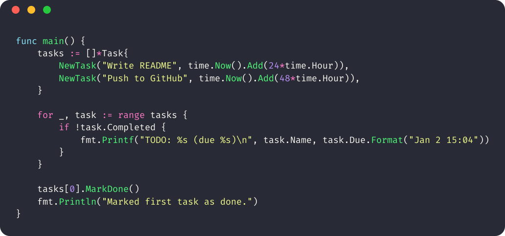

# codeshot.nvim

A simple Neovim plugin to **turn your visually-selected code into a beautiful screenshot**, powered by [`codeshot`](https://github.com/flothjl/codeshot).

<p align="center">

</p>

---

## ✨ Features

- Supports any code you can select in Neovim
- Tons of themes
- Feel free to bring your own font!

---

## 🚀 Quickstart

1. **Install [`codeshot`](https://github.com/flothjl/codeshot) CLI**

   ```sh
   go install github.com/flothjl/codeshot@latest
   ```

   Make sure `$GOBIN` is in your `$PATH`.

2. **Install with Lazy.nvim**

   Add to your plugins in `~/.config/nvim/lua/plugins/codeshot.lua`:

   ```lua
   return {
     "flothjl/codeshot.nvim",
     -- opts are optional!
     opts = {
       -- theme = "dracula",
       -- font = "/Users/you/.local/share/fonts/FiraCode-Regular.ttf",
     },
   }
   ```

3. **Usage**

   - In visual mode, select the code you want to screenshot.
   - Press `<leader>cs`  
     _or_ run the command `:Codeshot`
   - Your image is saved as `codeshot.png` in your project/startup directory!

---

## ⚙️ Options

You can override the theme and font with plugin options.  
These are passed as `opts = {}` in your Lazy.nvim plugin spec.

Example:

```lua
return {
  "flothjl/codeshot.nvim",
  opts = {
    theme = "gruvbox",
    font = "/Users/you/.local/share/fonts/JetBrainsMono-Regular.ttf",
  },
}
```

**Available options:**

- `theme` - Any Chroma style supported by codeshot (default: `"dracula"`)
- `font` - Path to a TTF font file (default: bundled FiraCode)

---

## 🖥️ Example Workflow

1. Select lines in visual mode:
2. Press `<leader>cs`
3. See a notification:

   ```
   Screenshot saved to:
   /path/to/your/project/codeshot.png
   ```

4. Use the image in your docs, slides, tweets, etc!

---

## 📝 Requirements

- Neovim 0.7+
- [codeshot CLI](https://github.com/flothjl/codeshot) (see install instructions above)
- A TrueType font file (bundled FiraCode or your own)

---

## 🛠️ Troubleshooting

- **Not seeing images?**  
  Make sure the `codeshot` binary is installed and available in your `$PATH`.
- **Font not found error?**  
  Specify an absolute path to a font with the `font` option.

---

## 🤝 Contributing

Pull requests welcome!  
Open an issue for ideas or bug reports.

---

## 📜 License

MIT

---

_Star this repo if you find it useful!_
